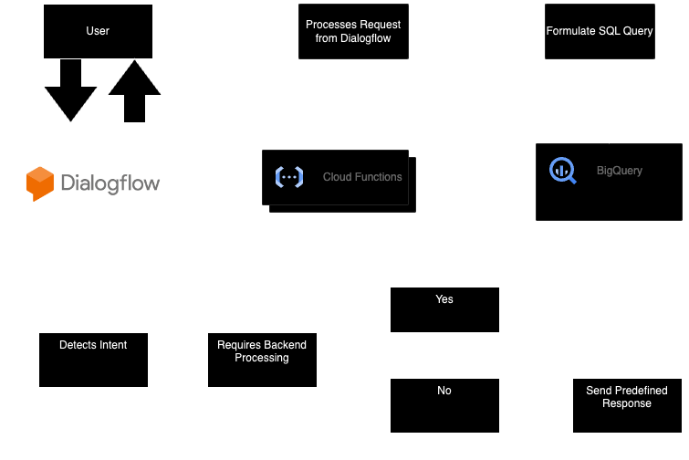

# Mac-FAQ-Chatbot
    

## Introduction

In today's digital age, chatbots have evolved as powerful tools for delivering immediate, personalized responses to users' queries. Leveraging the capabilities of chatbots, we aim to integrate a responsive and intuitive chatbot with popular university systems, specifically Microsoft Teams. This project seeks to harness the potential of chatbots to assist and enhance the user experience for students, faculty, and staff within the university ecosystem.

## Architecture



## Table of Contents

- [Introduction](#introduction)
- [Architecture](#architecture)
- [Project Overview](#project-overview)
- [Platform Details](#platform-details)
- [Timeline and Milestones](#timeline-and-milestones)
- [Next Stages and Enhancements](#next-stages-and-enhancements)
- [System Flow](#system-flow)
- [Contributors](#contributors)


## Project Overview

Our state-of-the-art chatbot is designed with a vision to:

- **Seamless Integration**: Integrate seamlessly with existing university systems such as Microsoft Teams and other platforms.
- **Continuous Learning**: The chatbot will possess the ability to learn continuously from past interactions with students, optimizing the responses for future queries.
- **Direct Resource Linking**: Instead of just providing information, the chatbot will provide direct links to necessary resources, making it easier for students and faculty to access them.
- **Feedback Mechanism**: To ensure that the chatbot keeps evolving and improving, we'll incorporate a feedback mechanism, allowing users to provide their suggestions for improvements.

## Platform Details

### Techstack:

- **Front End**: The chatbot will be integrated into platforms like Microsoft Teams and other systems using Google Cloud Dialogflow.
- **Backend**: Our backend operations will be powered by Google Cloud's Cloud Functions, ensuring smooth and scalable operations.
- **Database**: All data operations, storage, and retrieval will be managed through Google Cloud's BigQuery.

## Timeline and Milestones

1. **Database Design**: Craft a comprehensive database schema and diagram to support the chatbot's operations.
2. **Cloud Function Development**: Work on developing cloud functions to handle the backend logic and integration between Dialogflow and BigQuery.
3. **Dialogflow Training**: Spend quality time on training Dialogflow with diverse user inputs and scenarios to make it adept at handling varied student queries.
4. **End-to-end Integration**: Once individual components are ready, integrate them to establish a complete working system.
5. **Level 1 Testing**: Conduct initial rounds of testing to identify and rectify any issues or bugs in the system.

## Next Stages and Enhancements

As we move forward, we envision the following enhancements to our system:

- **Database Updates**: Regular updates to our database to include more information and improve response efficiency.
- **Enhanced Resource Linking**: We aim to update and expand the list of resources the chatbot can link to, ensuring users have access to the most recent and relevant information.
- **NLP Integration**: To make our chatbot more intuitive and user-friendly, we plan to incorporate more advanced Natural Language Processing techniques in the future.

## System Flow:

### 1. User Interaction

```
User
|
|---> Dialogflow Agent
|
|---> Detects Intent
|
|---> Requires Backend Processing?
|
|---> Yes: Send to Webhook (Cloud Function)
|
|---> No: Directly reply with predefined response
```


### 2. Backend Processing with Cloud Function

```Cloud Function Webhook
|
|---> Processes Request from Dialogflow
|
|---> Interacts with Google Cloud BigQuery
|
|---> Formulate SQL Query
|
|---> Fetch Result
|
|---> Prepare Response for Dialogflow
```


### 3. Displaying the Result
```
Dialogflow
|
|---> Receives Response from Cloud Function
|
|---> Formats Response (Text or Rich Responses)
|
|---> Sends to User Interface (Teams, etc.)
```

### 4. User Sees the Result
```
User Interface (Teams, etc.)
|
|---> Displays the received message to the user
```

## Contributors
| Contributor| Role | Notable Contributions 
|----------|----------|----------|
|  <br/> **Dharmik Joshi** <br/>  | <i/> Cloud Architect/Project Manager </i> | <ul><li>Project Design,  Management and Documentation</li><li>Access Management and Troubleshooting</li><li> Worked on Integrations and Creating Cloud Services</li></ul>  |
|  <br/> **Daniyal**  <br/>|  <i/> Backend Developer</i>  | <ul><li>Created Rest API in google cloud to extract user query and intent from Dialogflow</li><li>Based on our query book, retrieved user answers from Big query and formatted the response data</li><li> Tested our end to end integration for further verification using various questions</li></ul>   |
|  <br/> **Marwa Khafagy**  <br/>|  <i/> Cloud Developer </i>  | <ul><li>Worked on Dialogflow intents and entities.</li><li>Worked on User interactions and Inputs</li></ul>  |
| <br/> **Yunfei**  <br/>|  <i/> Database Developer</i>  | <ul><li>Created Automation scripts for scraping the websites for the FAQs</li><li>Wrote Integrations to upload the data scraped to the Google Cloud Bigquery</li><li> Formatted the data gathered in a key-words based format for better querying</li></ul>   |
| <br/> **Stella Gu**  <br/>|  <i/> Backend Developer</i>  | <ul><li>Worked with cloud functions and databases to process user request</li><li>Created SQL queries to retrieve information based on user intents</li><li> Customized a frontend design for chatbot webpage integration</li></ul>   |
| <br/> **Allison Zhao**  <br/>|  <i/> Backend Developer</i>  | <ul><li>Tested SQL queries for functionality and correctness</li><li>Worked with cloud functions and databases to process user request</li><li> Created SQL queries to retrieve information based on user intents</li></ul>   |
| <br/> **Krish Panchal**  <br/>|  <i/> Cloud Developer</i>  | <ul><li>Made a query book to search through the cloud database and send results to Dialogflow</li><li>Worked on the cloud function for the new database</li></ul>   |
